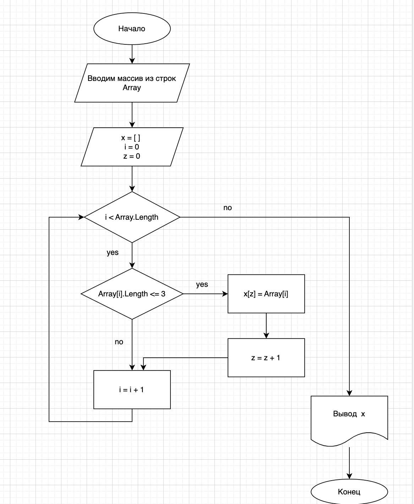

# Решение итогового проекта по итогам прохождения первого блока обучения на программе Разработчик.
## Задачи:
1. Создать репозиторий на GitHub
2. Нарисовать блок-схему алгоритма (можно обойтись блок-схемой основной содержательной части, если вы выделяете её в отдельный метод)
3. Снабдить репозиторий оформленным текстовым описанием решения (файл README.md)
4. Написать программу, решающую поставленную задачу
5. Использовать контроль версий в работе над этим небольшим проектом (не должно быть так, что всё залито одним коммитом, как минимум этапы 2, 3, и 4 должны быть расположены в разных коммитах)
## Решение:
1. Ссылка на GitHub [тут](https://github.com/anna-lopatina/ItogovoeZadaniePerviiBlok.git)
2. Блок-схема алгоритма 

3. См. данный файл
4. Решение задачи в файле Programm.cs
5. Создано 3 разных коммита:
- создали файл Readme;
- добавили блок-схему алгоритма;
- добавили программу выполнения алгоритма.
